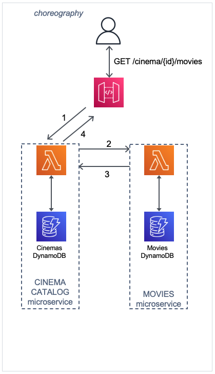

## CHOREOGRAPHY Pattern - AWS Serverless - Java

This is a Java implementation of the CHOREOGRAPHY Pattern using AWS Serverless services.



#### Description

This is a basic representation and implementation of the Choreography pattern. 
In Microservice architecture the application is divided in small services which are responsible for a singe business subdomain.
When these services need to communicate with each other there are several ways and different communication styles.
The Choreography pattern is one of them.

The SAM template contains all the information to deploy AWS resources and also the permission required by these service to communicate.

You will be able to create and delete the CloudFormation stack using AWS SAM.

This is fully functional example implemented in Java 11.

Important: this application uses various AWS services and there are costs associated with these services after the Free Tier usage - please see the AWS Pricing page for details. You are responsible for any AWS costs incurred.

#### Language:
#### This is a Maven project which uses Java 11 and AWS SDK

#### Framework
The framework used to deploy the infrastructure is SAM

#### Services used

#### API Gateway - AWS Lambda - DynamoDB

#### Deployment commands

````
mvn clean package

aws s3 mb s3://hifo8q34hfksdjnfpqwf

aws s3 cp target/sourceCode.zip s3://hifo8q34hfksdjnfpqwf

sam deploy --s3-bucket hifo8q34hfksdjnfpqwf --stack-name choreography-pattern --capabilities CAPABILITY_IAM
````

Add cinemas and movies in DynamoDB tables
````
aws dynamodb batch-write-item --request-items file://./dynamodb/movies.json

aws dynamodb batch-write-item --request-items file://./dynamodb/cinemas.json
````

#### TESTING

Copy the URL from the SAM Outputs:
CloudFormation outputs from deployed stack

Key                 PaymentsEndpoint                                                                                                                                                                                                
Description         API Gateway Cinema Endpoint                                                                                                                                                                                     
Value               https://XXXXXXXX.execute-api.XXXXXXXXXX.amazonaws.com/prod/cinema

Add the cinemaID/movies at the end of the URL. cinemaID available: aaaa and bbbb 

````
curl https://XXXXXXXX.execute-api.XXXXXXXX.amazonaws.com/prod/cinema/aaaa/movies -H "Accept: application/json"

curl https://XXXXXXXX.execute-api.XXXXXXXX.amazonaws.com/prod/cinema/bbbb/movies -H "Accept: application/json"
````

#### CLEAN-UP


````
aws cloudformation delete-stack --stack-name choreography-pattern

aws s3 rm s3://hifo8q34hfksdjnfpqwf --recursive

aws s3 rb s3://hifo8q34hfksdjnfpqwf
````
#### Requirements

* [Create an AWS account](https://portal.aws.amazon.com/gp/aws/developer/registration/index.html) if you do not already have one and log in. The IAM user that you use must have sufficient permissions to make necessary AWS service calls and manage AWS resources.
* [AWS CLI](https://docs.aws.amazon.com/cli/latest/userguide/install-cliv2.html) installed and configured
* [AWS Serverless Application Model](https://docs.aws.amazon.com/serverless-application-model/latest/developerguide/serverless-sam-cli-install.html) (AWS SAM) installed

#### Author
Razvan Minciuna
https://www.linkedin.com/in/razvanminciuna/
